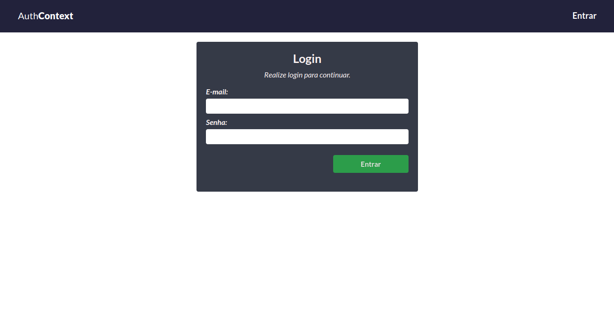

# Context-API

## Description

Essa aplicação consiste em uma tela de login, onde você ao efeituar o login é redirecionado para
a página Home. Ela foi desenvolvida para praticar **Context-API** do reactjs, para conseguir passar
pela validação será necessário utilizar apenas um **e-mail válido** e uma senha com mais de **5 caracteres.** 
Foi utilizado o **localStorage** para amarmazenar e persistir o e-mail do usuário e o estado dele na aplicação, **true** para autorizado e **false** para não autorizado. A aplicação tem **resposividade** até a resolução **285px** e possui uma **menu de navegação mobile**, que começa na resolução **550px**.

### Routes public:

- /login

### Routes private:

- /

## Tools

Ferramentas utilizadas no desenvolvimento.

React js  
[@ReactJs](https://pt-br.reactjs.org/)

React Router Dom V6  
[@ReactRouterDom](https://reactrouter.com/en/main)

HTML 5  
[@HTML5](https://developer.mozilla.org/pt-BR/docs/Web/HTML)

CSS 3  
[@CSS3](https://developer.mozilla.org/pt-BR/docs/Web/CSS)
